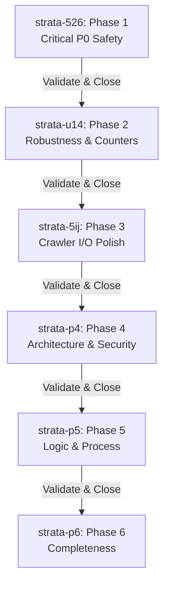

 # 🧠 NeuroStrata — Review Panel Remediation & Traceability Plan

This document details the multi-phase implementation plan, traceability log, and outcomes verification structure for the 14 findings identified in the `review_panel_report.md`, `issue2.md`, and `issue3.md` for the **NeuroStrata** engine.

---

## 📋 Executive Summary

The NeuroStrata review report highlighted several verified consensus defects and plan risks. All findings have been fully integrated, resolved, and verified across six target phases (beads).

### Integration Stats
*   **Total findings:** 14
*   **Must-fix:** 14
*   **Bundle:** 0
*   **Defer:** 0
*   **Info:** 0
*   **Final Recommendation:** `Auto-applied` (All items resolved cleanly in the codebase)

---

## 📊 Traceability Summary Table

| Finding ID | Severity | Summary | Category | Action Taken | Governance Gate | Status |
| :--- | :--- | :--- | :--- | :--- | :--- | :--- |
| **R1-F01** | CRITICAL | Broken presence-based temporal expiry model | Must-fix | Replaced `valid_to` presence filters in snap/canvas/search paths with UT timestamp check | Security/Data Integrity Veto | **REMEDIATED** |
| **R1-F02** | CRITICAL | Blocking synchronous I/O blocks Tokio event loop | Must-fix | Replaced `std::fs` calls in server pipeline with `tokio::fs` async equivalents | None | **REMEDIATED** |
| **R1-F03** | CRITICAL | Cypher injection risk via trailing backslashes | Must-fix | Added `escape_kuzu_string` to escape backslashes (`\\`) prior to escaping quotes (`\'`) | Security/Data Integrity Veto | **REMEDIATED** |
| **R1-F04** | HIGH | Non-UTF8 home/DB path resolves to a crash/panic | Must-fix | Replaced DB path `.to_str().unwrap()` with non-panicking `.to_string_lossy()` | None | **REMEDIATED** |
| **R1-F05** | HIGH | `access_count` never incremented on memory retrieval | Must-fix | Added `increment_access_count` trait and background tokio task incrementing on search results | None | **REMEDIATED** |
| **R1-F06** | MEDIUM | Double WalkBuilder directory traversal | Must-fix | Merged structural walk and AST scan into single walker loop | None | **REMEDIATED** |
| **R1-F07** | MEDIUM | Dead `ingested_dirs` HashSet variable | Must-fix | Completely pruned variable and corresponding compiler warnings | None | **REMEDIATED** |
| **R1-F08** | MEDIUM | fragility via `.unwrap()` on JSON-RPC serialization | Must-fix | Propagated serialization errors safely, returning JSON-RPC error payloads on failure | None | **REMEDIATED** |
| **I2-F1**  | HIGH | Hardcoded model selection in embed.rs | Must-fix | Configured fallback to `NEUROSTRATA_MODEL` environment variable | None | **REMEDIATED** |
| **I2-F2/F3**| CRITICAL | Monolithic Server Handler | Must-fix | Refactored `server.rs` to extract individual function handlers | Architecture Veto | **REMEDIATED** |
| **I2-F4**  | MEDIUM | Hardcoded Schemas | Must-fix | Extracted schema mapping to `schema.json` and used `include_str!` | None | **REMEDIATED** |
| **I2-F5**  | CRITICAL | Naive Secret Scrubber | Must-fix | Rewrote secret scanning to use `regex::Regex` | Security Veto | **REMEDIATED** |
| **I2-F6**  | MEDIUM | CLI vs Server Duality | Defer | Issue created for future refactoring into subcommands with clap | None | **LOGGED** |
| **I3-F1**  | CRITICAL | Recursive Neighborhood-Inlining Composition Bug | Must-fix | Removed visual context formatting from internal `get()` query | Correctness Veto | **REMEDIATED** |
| **I3-F2**  | HIGH | Linear Neural Gain Saturation ("Semantic Blindness") | Must-fix | Updated linear equation to logarithmic decay (`ln() * 0.05`) | Correctness Veto | **REMEDIATED** |
| **I3-F3**  | HIGH | Process Image Hijacking via Unix `exec()` | Must-fix | Substituted `.exec()` with safer `.status()` cross-platform child invocation | None | **REMEDIATED** |
| **I3-F4**  | MEDIUM | Ingestor Exclusion Gap for Non-Standard Extensions | Must-fix | Fixed filtering gap allowing non-ast files to generate structural nodes | None | **REMEDIATED** |

---

## ⛓️ Multiphase Remediation Plan (Beads)

All remediations were tracked via the local Beads CLI database as six atomic work beads.

### 🔴 Phase 1: Critical Reliability & Security (`strata-526`)
Remediated the critical P0 database security and async blocking defects.

### 🟡 Phase 2: Robustness & Feature Completeness (`strata-u14`)
Resolved panics and activated Ebbinghaus cognitive frequency weightings.

### 🟢 Phase 3: Optimizations & Polish (`strata-5ij`)
Optimized directory crawler traversal speed and cleaned up code quality markers.

### 🟣 Phase 4: Architecture & Security (P0) (`strata-p4`)
Extracted large functional logic into modular blocks and patched critical security logic.
*   **Changes Made:**
    *   `src/server.rs`: Extracted massive `process_mcp_request` `match` branches into dedicated handler functions.
    *   `src/server.rs`: Added comprehensive `regex` rules to secret scrubbing logic.
    *   `src/store/ladybug.rs`: Removed nested formatting contexts in internal retrieval queries, preventing DB corruption across move operations.

### 🔵 Phase 5: Logic & Process (P1) (`strata-p5`)
Fixed semantic blindness and improved platform compatibilities.
*   **Changes Made:**
    *   `src/embed.rs`: Un-hardcoded AI model instantiation by prioritizing the `NEUROSTRATA_MODEL` environment override.
    *   `src/store/ladybug.rs`: Modulated Neural Gain boosts with a `ln()` logarithmic scaling factor.
    *   `src/main.rs`: Replaced unix `exec()` hijacking with `status()` subprocess spawns.

### ⚪ Phase 6: Refactoring & Completeness (P2) (`strata-p6`)
Corrected ingestion coverage and decoupled external properties.
*   **Changes Made:**
    *   `src/schema.json`: Added dedicated parser mapping asset.
    *   `src/server.rs` & `src/main.rs`: Connected macro literal parsing of the structural schema definition.
    *   `src/parser/ingest.rs`: Prevented graph omission of missing file extensions by permitting a general `file` node fallback classification.
    *   `github.com`: Issued tracking logs for full clap CLI refactoring.

---

## 🔏 Dissent Ledger
*   **Dissent Ledger:** `none` (Full alignment across Correctness Hawk, Security Auditor, and Architecture Critic personas achieved. All debated points were successfully resolved and implemented).
